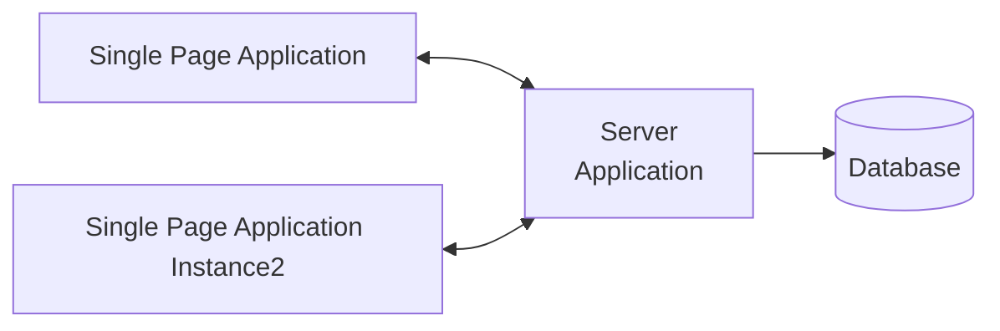
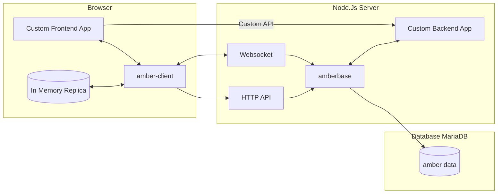
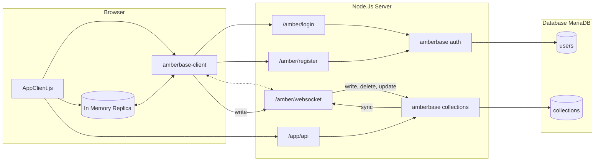

# Amberbase Concept (draft)

## Why

The idea is to create a library style system to support use cases that are often implemented by the likes of FireBase, Supabase and similar PaaS (or quasi PaaS) systems. Those tend to become proprietary dependencies and can eventually lead to unforeseen cost or bottlenecks when the cost is not acceptable. Especially for small non-profit oriented projects this becomes a problem. The leading project in our effort is [SongDrive](https://github.com/devmount/SongDrive) and its effort to migrate away from FireBase.

## Leading Principles and Constraints

AmberBase should be a library that can be used in a shared hosting environment with a target cost per month of smaller or equal to 10€ (as of now).
We want to support fast (hesitant to use the word `real-time`, because this would be in-accurate) notification towards clients about database updates.
It will NOT support horizontal scaling for all use cases (like automatic client synchronization).
It should be a workable mix of the two tier architecture inspired by something like Firebase and proper three tier architecture (that means being able to use a server side application specific controller tier).

The leading frontend library that we want to guarantee a good interaction with is Vue.js 3 (derived from the SongDrive lead product).

We wanto to limit the UI shipped to a set of common tasks. All of those are optional and opt-in since every more ambitious app build with Amberbase will most likely build all this UI targeted and customized to its needs.

We want to use the simplicity and client compatibility of JSON as the storage (and DTO) data format.

We want to support offline use cases (read-only) and therefore focus on full-data synchronization (since we need client side query for that). There might be some documents that a user does not have access to, even though he or she has access to a collection. These documents should be transparently filtered out.
> Example use case: A user has annotations (e.g. the order of song parts or the preferred key and position of a capo on a guitar) on a song that are private for him. Or a setlist that is shared only with a limited group of people.

## Technology Choices

The libraries will support the server implementation for Node.js and the client binding in a browser, both in TS/JS.
The reason to pick NodeJs as the server side technology is to have a single-process that does handle all requests and can share signals and in-memory state to enable the notification to a websocket as a side effect of another request.
The supported database should be MySql/MariaDB due to their support

## Glossary and Definitions

* `Client` Client library executed in the browser
* `Tenant` A top-level labeling of all data to host multiple separate instances of the same application on one database. All operations are relative to a tenant and scope to a tenant. Example: SongDrive being hosted once but used by multiple churches.
    * Some functionality is outside of the scope of a `tenant` (e.g. to create a `tenant`). This is called the `global` scope
* `User` An identified user of the web application
* `Role` A server defined set of permissions that can be given to a user within a `tenant`
    * There is a special role `admin` that gives build in functionality on the `global` scope or on a `tenant`
    * The `global` scope can also be used to give `roles` to a user that are inherited into each tenant
* `Invitation` A token that is not associated to a user yet, but can be used by a new or existing user to gain access to a tenant and to be associated with roles.
* `Collection` equivalent of a table. It is identified by a name and can store multiple JSON `Documents`
* `Document` A JSON object stored in the database in one collection, one tenant, and is identifiable via a unique id
* `Subscription` A capability of the client library and proprietary server API to get all updates that fall under a certain `Subscription Scope`
* `Client Cache` A copy of database objects present in the client. The goal is to synchronize this cache as soon as the client is connected to the server (again).
* `Access Tag` A tag on a document that can be used to filter documents based on a users access rights or identity.
* `Tag` a general purpose tag to optimize the search and processing of documents through indexing
* `Channel` a means to communicate between apps running in browsers with each others (but always constraint to the tenant). The communication is not persisted

## Use Cases

The use cases are determined by Firebases offering and SongDrives usage but will grow beyond that.

### IAM

A simple user management system where users can

* Register themselves (with email and password)
* Forward access to a `tenant` by `invitations` that can be redeemed by a user
* Provides `admin` access to `tenants` as well as `admin` access to the `global` plane to manage `users` and `roles`
* Be associated to `roles` by admin users (i.e. via a server library API)
* Login
* Create a `subscription`, create, update or delete on a `collection` only if the role allows that
* Control access to `channels` to certain users
* Allow to store the login information to auto-login the next time (of course by using a signed token, not the real credentials)
* Create a concept to limit documents to certain users (private for owner, sharing with users...)
* Find more details regarding user and access management in the separate [document about this topic](user-management.md)

### Database Client Replication

A client should be able to read data from collections that the logged-in user has access to.
This will always be a full collection (scoped to the `tenant`).
The client shall store the data in a way that it is available even when the server is down. 

### Database Synchronization

A client can request subscriptions from the server and the server should send updates to clients to keep the replica up to date. When a network outage occurred, the client should try to reconnect (e.g. in defined time intervals) and a catch-up mechanism should make sure that missing updates are replayed as soon as a connection is established again, including deletions.


### Standard Server-Side Write Operations

The server library should be able to provide a write api that is automatically exposed through the client library.

* Authorization decisions can be expressed via a callback predicate (with user context and write target as input) or through configuration
* Invoke write operations to the database
* Send synchronization messages to subscribed clients. This needs to include new documents, updated documents and deletion of documents

### Custom Server-Side Write Operations

Write operations should be possible to be realized using standard fetch-API interactions. Custom code server side should be able to easily

* Verify the user context (securely)
* Make authorization decisions based on the role
* Invoke write operations to the database
* Send synchronization messages to subscribed clients

# Technical Architecture

## Overview Diagrams

### Context



### Components



### Simplified Dataflow



## Synchronization

There are two main challenges to implement quasi-realtime replication of a data collection to multiple clients. Notifying all clients when a change happens, and getting all change notifications as a client that had an interrupted connection.

### Notification Broadcast

Since NodeJs shares a common execution context with all requests, we can send a message to websockets as a side effect of an HTTP POST request executed in the same server. Our solution is therefore:

* We establish a websocket connection from every client to the server process
* The client subscribes to collections, this subscription interest is kept server side as in memory state for the lifetime of the websocket
* Every write to a collection is followed by a notification (containing the new data) to all subscribed websockets

> We should build a mechanism that invalidates collection subscriptions if a users roles are changed (just kill the websocket and let the client recover)

### Catch-Up

To enable a client to request all changes that are new to a collection, we need to introduce the concept of a "moment" that the last synchronization took place as a virtual time concept. Since we have a single server process, this can just be a monotonic counter of changes per collection we will refer to it as the collections `change-counter`. Sketching this process:

* The server starts and retrieves the current `change-counter` and keeps it in memory
* Every time an document is changed or added, the `change-counter` is increased, added to the document as a field called `change-number` and persisted as the collections new `change-counter` in the database
* Every client that connects or reconnects sends the highest `change-number` it has in its local replica when it subscribes to a collection.
* The server will send the updates of the documents that have a higher `change-number` to update the replica

There is one tricky situation: If a client persists a cache and comes online again it not only needs to be informed about updates and new documents. It also needs deleted and documents that the user lost access to. For that we need to introduce a new table to store those actions (changes in `access tags` and deletions)

## Concurrency

Due to the single execution thread nature of Node.Js we can easily manage most server side concurrency challenges. For client originated write operations we want to use the concept of "optimistic concurrency":

* Every write operation that targets an existing document needs to include the `change-number` as it is present on the client (e.g. from a replica)
* The server will check the `change-number` provided against the actual `change-number` in the database before changing the document and reject the request if they do not match.

## Server Side Filter for Per-User-Access

To support use cases where some document should only be accessible (that means read and writable) by dedicated users without reading all documents from the database and filter them out in code, we need to have a concept to support some database side filtering.
We do that by deriving `access tags` from documents (configurable per `collection` by JS code) and using them to index the database. We also derive `access tags` from users (again using some JS code as configuration per `collection`). A document shall only be accesssible if at least one `user` derived `access tag` is also part of the `document` `access tag`. This filtering can be supported by the database.

With that we can, for example, have the following access tags derived from a user:

* UserId `123` with roles `editor` and `batman` ➡️ derived `access tags`: [`user-123`,`sharedWith-123`, `public`, `onlyBatman`]
* Document `{isPublic:false, forBatman:false, user:123, shared:[]}` ➡️ derived `access tags`: [`user-123`]  ➡️ overlapping tags, access granted
* Document `{isPublic:true, forBatman:false, user:234, shared:[42,21]}` ➡️ derived `access tags`: [`shared-42`,`shared-42`, ] ➡️ overlapping tags, access granted

## Configuration

The configuration of the server side library needs to contain the connection to the database and the necessary application specific modelling to let `amber` do its magic. Here is a draft configuration as a json object:

```json
{
    "db":{
        "host":"localhost",
        "port": "",
        "database" : "my_db",
        "user" : "hopefullynotroot",
        "password" : "hopefullyinsertedduringstartupfromasecret"
    },
    "collections":["foo", "bar"],
    "roles":{
        "reader":{
            "foo": "r", // read access
            "bar": "r" // read access
        },
        "writer":{
            "foo": "rw", // read and write access
            "bar": "rw"  // read and write access
        }
    }
}
```

This configuration can be given to the startup configuration of the amber framework. That means in JavaScript or Typescript code.

## Custom authorization

The example in the configuration shows a "static" access rights mapping between `roles` and `collections`. To create a more sophisticated row base access system, we can use callbacks.
A use case can be a document `song` that contains a list of user ids it is shared with.

```js
var config:AmberConfig = {"db_endpoint" : "...", ...};
var amberApp = amber(config)
    .withCollection("songs", [{"role": "editor", "access" : "rw"},{"role": "reader", "access" : "r"}])
    .withCollection("private", (d:document, u:user, requestedAction:actionType) => {
        if (u.role == "editor" && requestedAction == "read" && d.dataJson["sharedWith"].find(u.id)) {
            return true;
        }
        // other logic for create, delete etc...
    }
    );
```

## Predefined Roles and Bootstrap

Additionally to the roles defined in the configuration there is a predefined role called `user_admin` that can be given to a user.
To bootstrap a first user to use it, the server side library should support something like

```js
var userId = amberServer.addUser("foo@bar.de", "I am Admin", "myFirstPassword");
amberServer.addRole(userId, `user_admin`);
```

With that, we can add user management functionality to the client library and simplify the development of the UI for that use case.
