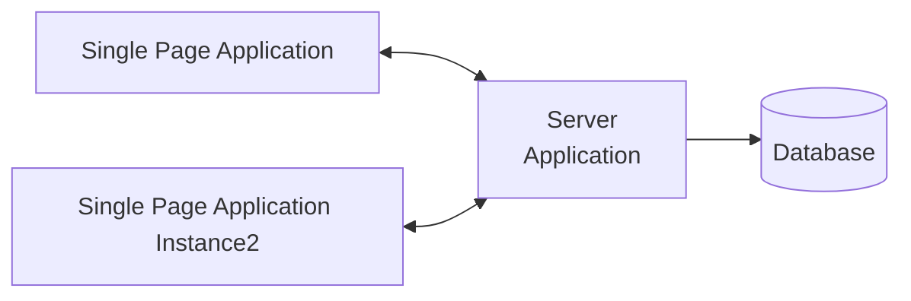
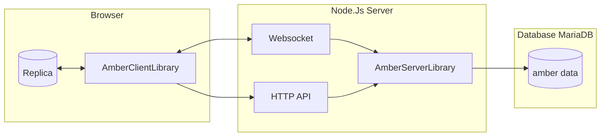
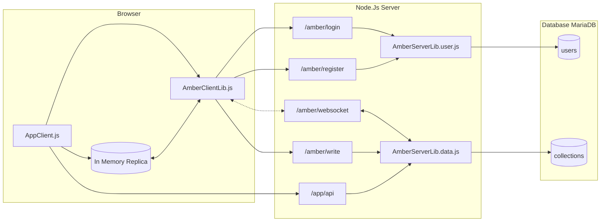

# AmberBase Concept (draft)
## Why
The idea is to create a library style system to support use cases that are often implemented by the likes of FireBase, Supabase and similar PaaS (or quasi PaaS) systems. Those tend to become proprietary dependencies and can eventually lead to unforseen cost or bottlenecks when the cost is not acceptable. Especially for small non-profit oriented projects this becomes a problem. The leading project in our effort is [SongDrive](https://github.com/devmount/SongDrive) and its effort to migrate away from FireBase.

## Leading Principles and Constraints

AmberBase should be a library that can be used in a shared hosting environment with a target cost per month of smaller or equal to 10€ (as of now). 
We want to support fast (hesitant to use the word `real-time`, because this would be in-accurate) notification towards clients about database updates.
It will NOT support horizontal scaling for all use cases (like automatic client synchronization).
It should be a workable mix of the two tier architecture inspired by something like Firebase and proper three tier architecture (that means being able to use a server side application specific controller tier).

The leading frontend library that we want to guarantee a good interaction with is Vue.js 3 (derived from the SongDrive lead product).

We do not plan (for now) to ship any UI, only libraries and APIs

We want to use the simplicity and client compatibility of JSON as the storage (and DTO) data format.

We want to support offline use cases (read-only) and therefore focus on full-data synchronization (since we need client side query for that)
> __(Question)__ Do we? Or should we have server AND client queries executed in parallel where the local might miss some results? That means that we would support partial replication into the client and only those documents would be synchronized and extended with data added after additional server side searches... Maybe not as MVP?

## Technology Choices
The libraries will support the server implementation for Node.js and the client binding in a browser, both in TS/JS.
The reason to pick NodeJs as the server side technology is to have a single-process that does handle all requests and can share signals and inmemory state to enable the notification to a websocket as a side effect of another request.
The supported database should be MySql/MariaDB due to their support

## Glossary and Definitions

* `Client` Client library executed in the browser
* `Tenant` __(Proposal)__ A top-level labeling of all data to host multiple separate instances of the same application on one database. All operations are relative to a tenant and scope to a tenant. Example: SongDrive being hosted once but used by multiple churches.
* `User` An identified user of the webapplication
* `Role` A server defined set of permissions that can be given to a user
* `Collection` equivalent of a table. It is identified by a name and can store multiple JSON `Documents`
* `Document` A JSON object stored in the database in one collection, one tenant, and is identifieable via a unique id
* `Subscription` A capability of the client library and proprietary server API to get all updates that fall under a certain `Subscription Scope`
* `Client Cache` A copy of database objects present in the client. The goal is to synchronize this cache as soon as the client is connected to the server (again).
  

## Use Cases

The use cases are determined by Firebases offering and SongDrives usage and future plans.

### IAM
A simple user management system where users can 
  * Register themselves (with email and password)
  * __(Proposal)__ Request access to a tenant
  * Be associated to roles by admin users (i.e. via a server library API)
  * Login 
  * connect to datasources only if the role allows that
  * Allow to store the login information to auto-login the next time (of course by using a signed token, not the real credentials)

### Database Client Replication
A client should be able to read data from collections that the logged-in user has access to.
This will always be a full collection (scoped to the `tenant`).
The client shall store the data in a way that it is available even when the server is down.
> __(Question)__ We could use the localStorage and some PWA-magic to operate without initial server connection. Is that a requirement?

### Database Synchronization
A client should add subscriptions to the server and the server should send updates to clients to keep the replica up to date. When a network outage occurred, the client should try to reconnect (e.g. in defined time intervals) and a catch-up mechanism should make sure that missing updates are replayed as soon as a connection is established again.

Along with the actual data, the client must always serve meta information about the origin of the data. This enables the user to get to know, if data comes from the server (= truth) or from a local copy (= maybe truth).

### Standard Server-Side Write Operations
The server library should be able to provide a write api that is automatically exposed through the client library. 
* Authorization decisions can be expressed via a callback predicate (with user context and write target as input) or through configuration
* Invoke write operations to the database
* Send synchronization messages to subscribed clients

### Custom Server-Side Write Operations
Write operations should be possible to be realized using standard fetch-API interactions. Custom code server side should be able to easily 
* Verify the user context (securely)
* Make authorization decisions based on the role
* Invoke write operations to the database
* Send synchronization messages to subscribed clients
> __(Question)__ We could also implement that as callbacks on the websocket channel server side as an alternative.


# Technical Architecture

## Overview Diagrams
### Context 


### Components


### Simplified Dataflow



## Synchronization
There are two main challenges to implement quasi-realtime replication of a data collection to multiple clients. Notifying all clients when a change happens, and getting all change notifications as a client that had an interrupted connection.
### Notification Broadcast
Since NodeJs shares a common execution context with all requests, we can send a message to websockets as a side effect of an HTTP POST request executed in the same server. Our solution is therefore:
* We establish a websocket connection from every client to the server process
* The client subscribes to collections, this subscription interest is kept server side as in memory state for the lifetime of the websocket
* Every write to a collection is followed by a notification (containing the new data) to all subscribed websockets

### Catch-Up
To enable a client to request all changes that are new to a collection, we need to introduce the concept of a "moment" that the last synchronization took place as a virtual time concept. Since we have a single server process, this can just be a monotonic counter of changes per collection we will refer to it as the collections `change-counter`. Sketching this process:

* The server starts and retrieves the current `change-counter` and keeps it in memory
* Every time an document is changed or added, the `change-counter` is increased, added to the document as a field called `change-number` and persisted as the collections new `change-counter` in the database
* Every client that connects or reconnects sends the highest `change-number` it has in its local replica when it subscribes to a collection.
* The server will send the updates of the documents that have a higher `change-number` to update the replica

## Concurrency
Due to the single execution thread nature of Node.Js we can easily manage most server side concurrency challenges. For client originated write operations we want to use the concept of "optimistic concurrency":
* Every write operation that targets an existing document needs to include the `change-number` as it is present on the client (e.g. from a replica)
* The server will check the `change-number` provided against the actual `change-number` in the database before changing the document and reject the request if they do not match.

## Database Structure
### User Management 
#### Table `Users`
* `name` string, visible name
* `credential_hash` string, salted password hash "(salt):(SHA256)"
* `email` string, unique
* `id` uuid, stable unique id to potential allow e-mail change

#### Table `Roles`

* `user` uuid, foreign key to `Users.id`
* `tenant` string, forms the primary key together with `user`
* `roles` string, comma separated list of roles given to the user in this tenant

#### Table `Tenants`

* `id` string
* `name` string, descriptive label
* `data` string, JSON object of potential properties

#### Table `Data`
* `tenant` string, tenant id
* `collection` string, collection name
* `id` uuid, unique document id
* `change_number` int, change counter stamp
* `change_user` uuid, users id of the last modifying user
* `change_time` datetime, last update time
* `data` JSON, the payload

## Configuration
The configuration of the server side library needs to contain the connection to the databse and the necessary application specific modelling to let `amber` do its magic. Here is a draft configuration as a json object:
```json
{
    "db":{
        "host":"localhost",
        "port": "",
        "database" : "my_db",
        "user" : "hopefullynotroot",
        "password" : "hopefullyinsertedduringstartupfromasecret"
    },
    "collections":["foo", "bar"],
    "roles":{
        "reader":{
            "foo": "r", // read access
            "bar": "r" // read access
        },
        "writer":{
            "foo": "rw", // read and write access
            "bar": "rw"  // read and write access
        }
    }
}
```

## Predefined Roles and Bootstrap
Additionally to the roles defined in the configuration there is a predefined role called `user_admin` that can be given to a user.
To bootstrap a first user to use it, the server side library should support something like
```js
var userId = amberServer.addUser("foo@bar.de", "I am Admin", "myFirstPassword");
amberServer.addRole(userId, `user_admin`);
```

With that, we can add user management functionality to the client library and simplify the development of the UI for that use case.


